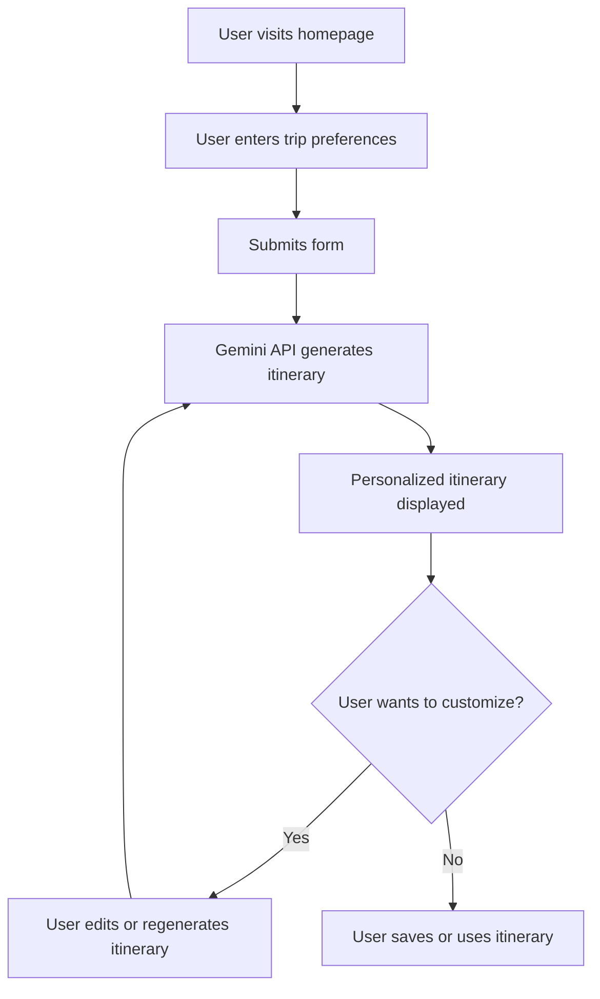

# Voyageur: AI Travel Assistant


*Homepage: Describe your trip and explore features.*


*Personalized itinerary with daily plans, map, and recommendations.*

Voyageur is an AI-powered travel assistant that helps you plan your perfect trip with personalized, day-by-day itineraries. Just describe your ideal trip in natural language—destination, duration, interests, and budget—and get a detailed, interactive plan tailored to you.

## Features

- **Personalized Itineraries:** Get detailed day-by-day plans tailored to your preferences and travel style.
- **Interactive Maps:** Visualize your trip with interactive maps showing all recommended locations.
- **Dining Recommendations:** Discover local cuisine and restaurants that match your taste and budget.
- **Accommodation Options:** Find the perfect place to stay, from luxury hotels to budget-friendly hostels.
- **Flight Suggestions:** Get estimated flight options to start planning your journey.
- **Customizable Plans:** Easily refine and adjust your itinerary to make it perfect for you.

## How It Works

1. **Describe Your Trip:** On the homepage, enter your travel preferences (e.g., "Plan a 3-day trip to Barcelona with a focus on architecture and local cuisine").
2. **Generate Itinerary:** The app uses AI (mocked for MVP) to generate a personalized itinerary, including daily activities, dining, hotels, and flights.
3. **Explore & Customize:** View your itinerary, explore it on an interactive map, and adjust as needed.

## User Flow



## TODO
- User login/sign up
- Show itinerary on Google Maps
- Fetch flight suggestions from Google Flights / Sky Scanner API
- Fetch hotel suggestions from Booking.com or other hotels API
- Fetch dining details from suggestion
- Fetch activities details from tour agencies like Klook

## Example Queries
- "Plan a 3-day trip to Barcelona with a focus on architecture and local cuisine"
- "Weekend getaway to New York City on a moderate budget, interested in theater and art"
- "7-day family vacation in Tokyo with kid-friendly activities and cultural experiences"

## Tech Stack
- **Framework:** Next.js 15 (App Router, React 18)
- **Styling:** Tailwind CSS
- **UI Components:** Radix UI, Lucide Icons
- **Type Checking:** TypeScript
- **State Management:** React Hooks
- **Other:** Zod, date-fns, recharts, and more

## Getting Started

1. **Install dependencies:**
   ```bash
   npm install
   ```
2. **Add API key to .env file:**
   ```bash
   NEXT_PUBLIC_GEMINI_API_KEY=your_api_key_here
   ```
3. **Run the development server:**
   ```bash
   npm run dev
   ```
4. **Open your browser:**
   Visit [http://localhost:3000](http://localhost:3000)

## Project Structure
- `app/` — Main app pages and routing
- `components/` — Reusable UI and feature components
- `lib/` — Utility functions and mock data

## Deployment
This app requires a serverless/server runtime (not static export) for dynamic itinerary generation. Deploy to platforms like Vercel, Netlify, or any Node.js server.

## License
MIT
